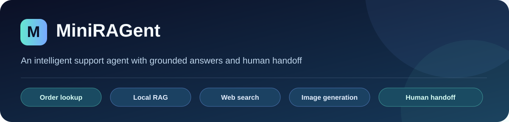
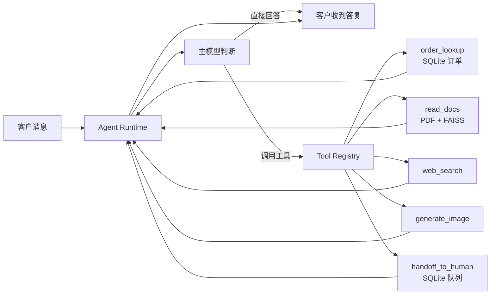
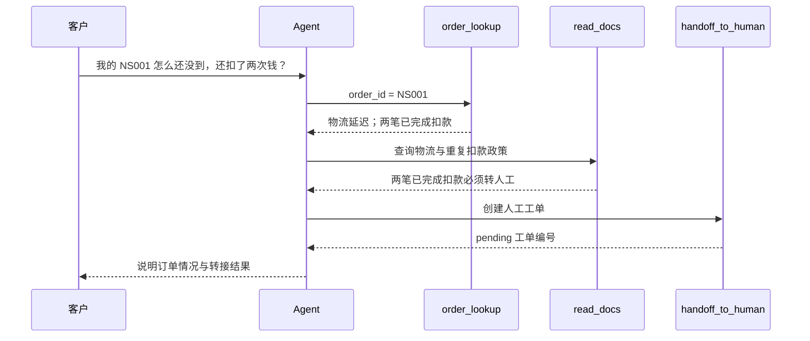

<div align="center">



# MiniRAGent

**能查订单、查政策、生成图片，并在需要时转人工的本地客服 Agent**

`Python` · `FastAPI` · `OpenAI-compatible API` · `SQLite` · `FAISS` · `sentence-transformers`

[快速开始](#快速开始) · [体验示例](#体验示例) · [工作流程](#工作流程) · [工具列表](#工具列表)

</div>

MiniRAGent 是一个可运行的客服 Agent 示例。主模型根据 Tool Registry 提供的工具名称、描述和参数，自主选择直接回答或调用工具。订单事实来自 SQLite，客服政策来自本地 PDF 知识库；人工排队、权限检查与工单状态由后端代码处理。

> **演示说明：** NovaShop 是虚构电商，订单和客服政策均为模拟数据。当前网页固定使用 `user_001`，方便直接测试 NS001～NS007。多用户登录和正式身份认证尚未接入。

## 能做什么

| 能力 | 当前实现 |
| --- | --- |
| 订单查询 | 按订单号查询当前用户自己的订单；模型不能提供 `user_id` 或任意 SQL |
| 本地知识库 | 读取 NovaShop 英文客服 PDF，使用本地 all-MiniLM-L6-v2、FAISS 检索政策 |
| 网络搜索 | 按需使用 Tavily 查询变化中的外部信息 |
| 图片生成 | 可直接生成图片，或先查询政策/网络资料后据此整理提示词 |
| 人工客服 | 创建工单、后端排序、人工接管与独立聊天窗口 |
| 对话记录 | SQLite 保存会话和消息，支持上下文与长期记忆 |

## 工作流程



具体订单问题会先查订单，再查相关政策。例如 NS001 在数据库中标记为物流延迟且有两笔已完成扣款，知识库规定此类重复扣款必须转人工：



## 工具列表

| 工具 | 作用 | 模型提供的主要参数 |
| --- | --- | --- |
| `order_lookup` | 查当前用户订单 | `order_id` |
| `read_docs` | 查本地客服知识库 | `query`、可选 `top_k` |
| `web_search` | 查网络信息 | `query`、可选 `max_results` |
| `generate_image` | 生成并保存图片 | `prompt`、可选 `size` |
| `handoff_to_human` | 创建人工工单 | `reason`、`issue_summary`、`priority` |

工具的 Schema 由 `tools/registry.py` 汇总后传给主模型。`order_lookup` 的用户身份和 `handoff_to_human` 的用户/会话身份由 Runtime 从当前 Session 补充。

## 快速开始

下面的命令从本项目目录执行。推荐 Python 3.11；已有 `mini-ragent` Conda 环境时可直接激活。

```powershell
conda create -n mini-ragent python=3.11 -y
conda activate mini-ragent
pip install -r requirements.txt
```

复制配置示例并填写你自己的 OpenAI-compatible 主模型 API 信息。**不要把真实密钥提交到 GitHub。** Tavily 只在使用网络搜索时需要。

```powershell
Copy-Item .env.example .env
```

`.env` 中填写 `LLM_API_KEY`、`LLM_BASE_URL`、`LLM_MODEL`；网络搜索另填写 `TAVILY_API_KEY`。图片功能使用单独的 `.env_image`，需要时再配置：

```powershell
Copy-Item .env_image.example .env_image
```

本地嵌入模型不包含在 GitHub 仓库里。安装依赖后，从 [Hugging Face 的 all-MiniLM-L6-v2](https://huggingface.co/sentence-transformers/all-MiniLM-L6-v2) 下载到 `models/all-MiniLM-L6-v2/`：

```powershell
python -c "from huggingface_hub import snapshot_download; snapshot_download(repo_id='sentence-transformers/all-MiniLM-L6-v2', local_dir='models/all-MiniLM-L6-v2', allow_patterns=['*.json','*.txt','*.safetensors','1_Pooling/*'])"
```

启动后打开客户页面 `http://127.0.0.1:8000/`，人工客服页面在 `http://127.0.0.1:8000/human`：

```powershell
python -m uvicorn app:app --host 127.0.0.1 --port 8000
```

仓库附带虚构客服 PDF 与对应的小型 FAISS 索引。若替换或上传 PDF，可在页面的知识库区域重新建立索引。

## 体验示例

在客户页面直接输入，建议每个问题开启新会话：

| 输入 | 预期流程 |
| --- | --- |
| “我的 NS003 现在可以取消吗？” | `order_lookup → read_docs → 回答 Packing 状态不能取消` |
| “我的 NS001 为什么还没到，而且好像被扣了两次钱？” | `order_lookup → read_docs → handoff_to_human` |
| “帮我查一下 NS008。” | 查询被拒绝：该订单属于 `user_002` |
| “根据 NovaShop 的退货政策生成一张流程图。” | `read_docs → generate_image` |

实际模型可能为核对政策多次调用 `read_docs`；关键订单事实来自数据库，而不是模型猜测。

## 项目目录

```text
mini-ragent/
├── app.py                 # FastAPI 与前端入口
├── agent/                 # Agent Runtime
├── llm/                   # OpenAI-compatible LLM Client
├── tools/                 # Registry 与五个工具
├── rag/                   # PDF、分块、嵌入、FAISS、检索
├── session/               # 会话、订单、人工队列、记忆
├── static/                # 客户和人工客服页面
├── data/docs/             # 虚构客服 PDF
├── data/index/            # 对应的小型检索索引
├── tests/                 # 自动化测试
├── scripts/               # 真实 API 流程验证脚本
├── docs/                  # README 图片
├── .env.example
├── .env_image.example
└── requirements.txt
```

## 测试与上传范围

自动化测试（需安装 `pytest`）:

```powershell
python -m pip install pytest
python -m pytest -q
```

上传源码、静态页面、测试、虚构 PDF、小型索引和配置示例。`.gitignore` 排除真实 `.env` 密钥、本地模型、SQLite 会话/订单数据、生成图片、日志和临时文件。新电脑启动时会在本地 SQLite 中初始化九条模拟订单；运行中产生的真实会话数据留在本机。

这个项目目前是本地演示，不含正式用户认证、支付接口或真实电商订单对接。
